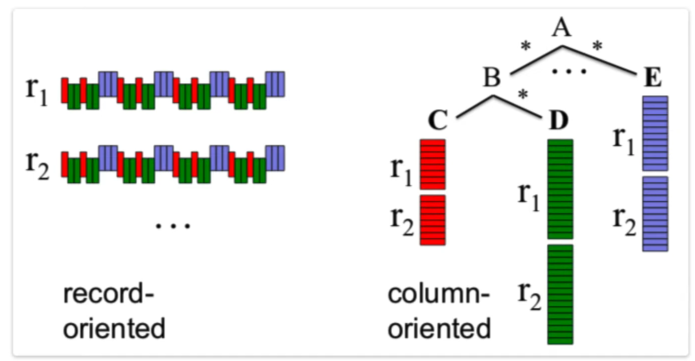
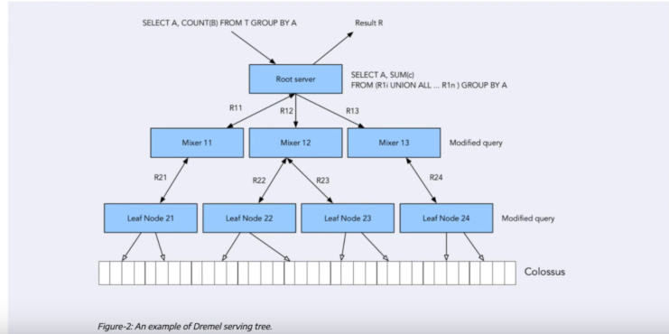
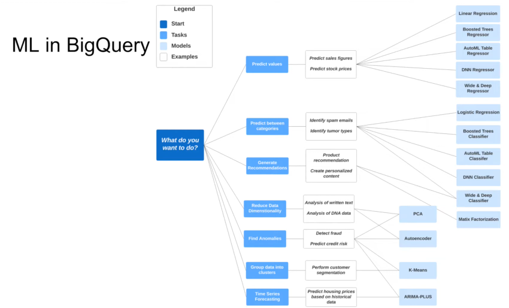

# Data Warehouse

* OLAP VS OLTP
* What is a Datawarehouse
* Big Query
    - Cost
    - Partitions and Clustering
    - Best practives
    - Internals
    - ML in BQ

## OLAP VS OLTP

OLTP: ONLINE TRANSACTION PROCESSING
OLAP: ONLINE ANALYTICAL PROCESSING

OLTP usually is for backend allowing for fall back and roll back in case of failure. OLAP is more for analytical situations.

OLTP has fast and small updates, while OLAP data is periodically refreshed and it's large in comparison to OLTP.

## what is a datawarehouse¿

It's an OLAP solution used for reporting and data analysis.

Contains raw data, metadata and summary. Usually solutions have multiple systems which are put into a staging area and introduced to a datawarehouse.

While business users might use datamarts for their reportings, users like data scientists might want to use the raw date for their analysis. 

## Big Query

It's biggest advantage is that it's serverless, no need to manage server or software that needs to be installed. 

Software as well as infrastructure including **scalability** and **hih-availability**

Some of the built in features in big query include:
* machine learning
* geospatial analysis
* business intelligence

Big query separates the compute engine from your storage, making it very flexible. 

### Big Query Cost

* On demand pricing, means that it charges for what you use. So you don't have to commit to a flat price spenditure, which can lead to savings.

### Big Query external tables

External tables allow Big Query to query data from files in your buckets. For example:

```
-- Creating external table referring to gcs path
CREATE OR REPLACE EXTERNAL TABLE `{PROJECT_NAME}.{DATABASE_NAME}.external_yellow_tripdata`
OPTIONS (
  format = 'CSV',
  uris = ['gs://{BUCKET_NAME}/trip data/yellow_tripdata_2019-*.csv', 'gs://{BUCKET_NAME}/trip data/yellow_tripdata_2020-*.csv']
);
```

The result of this query alows you to see the schema of the data in the csv files. Looking at the details shows that an external table does not load the data to big query, the table size would be zero as well as the long-term storage size. The data is still in the cloud storage bucket. 

#### Querying from the external table:

```
-- Check yello trip data
SELECT * FROM {PROJECT_NAME}.{DATABASE_NAME}.external_yellow_tripdata limit 10;
```

Here we can see results from the query just like when the table is loaded in the database itself. 

### Partition in BQ

When we create a table, we can use certain columns like creation_date, title, or tags to group data together. This improves the performance a lot. 


A non-partitioned table is usually less performant than a partitioned table, as long as the partitions are created properly.

To partition a table:

```
-- Create a partitioned table from external table
CREATE OR REPLACE TABLE {PROJECT_NAME}.{DATABASE_NAME}.yellow_tripdata_partitoned
PARTITION BY
  DATE(tpep_pickup_datetime) AS
SELECT * FROM {PROJECT_NAME}.{DATABASE_NAME}.external_yellow_tripdata;
```

As you can see, the partition by command makes it so that the pickup datetime is used to partition the table. Looking at the details of the table it will tell you that it is indeed partitioned and by which column.

The icon is also different on the partitioned tables, so you can see it right next to the name of the table.

When querying the same data from a partitioned table and from a non-partitioned table, the results are something like this:

```
-- Impact of partition
-- Scanning 1.6GB of data
SELECT DISTINCT(VendorID)
FROM {PROJECT_NAME}.{DATABASE_NAME}.yellow_tripdata_non_partitoned
WHERE DATE(tpep_pickup_datetime) BETWEEN '2019-06-01' AND '2019-06-30';

-- Scanning ~106 MB of DATA
SELECT DISTINCT(VendorID)
FROM {PROJECT_NAME}.{DATABASE_NAME}.yellow_tripdata_partitoned
WHERE DATE(tpep_pickup_datetime) BETWEEN '2019-06-01' AND '2019-06-30';
```

The partitioned table scans a much smaller amount of data, because it knows it has scanned all the data that can possibly contain those dates.

Partitions can also be inspected like this:

```
-- Let's look into the partitons
SELECT table_name, partition_id, total_rows
FROM `nytaxi.INFORMATION_SCHEMA.PARTITIONS`
WHERE table_name = 'yellow_tripdata_partitoned'
ORDER BY total_rows DESC;
```

This will show the number of rows per partition, this can help you find if there is bias in your partitions. Meaning some partitions contain more data than others, which is not ideal. 

### Clustering in BQ


In the image above, we can see that we've partitioned by date, but also clustered by the tag. Meaning that the rows for a same date and from a same OS are put together. So if you're looking for android data of a certain date, it will reach it faster and scanning less.

for example:

```
-- Creating a partition and cluster table
CREATE OR REPLACE TABLE {PROJECT_NAME}.{DATABASE_NAME}.yellow_tripdata_partitoned_clustered
PARTITION BY DATE(tpep_pickup_datetime)
CLUSTER BY VendorID AS
SELECT * FROM {PROJECT_NAME}.{DATABASE_NAME}.external_yellow_tripdata;
```

The clustering field will depends on how you will query the data. In this use case, it's queried by vendor id usually, improving performance.

These are the results of a partitioned table vs a partitioned and clustered table:

```
-- Query scans 1.1 GB
SELECT count(*) as trips
FROM {PROJECT_NAME}.{DATABASE_NAME}.yellow_tripdata_partitoned
WHERE DATE(tpep_pickup_datetime) BETWEEN '2019-06-01' AND '2020-12-31'
  AND VendorID=1;

-- Query scans 864.5 MB
SELECT count(*) as trips
FROM {PROJECT_NAME}.{DATABASE_NAME}.yellow_tripdata_partitoned_clustered
WHERE DATE(tpep_pickup_datetime) BETWEEN '2019-06-01' AND '2020-12-31'
  AND VendorID=1;
```

It has improved how much data is scanned by a fair margin. This all leads to cost savings from processing less data. 

## Deep dive on Partitioning and Clustering


### Partitioning details

In BQ when creating a partitioned table, you can use: 

* Time-unit column
* Ingestion time (_PARTITIONTIME)
* Integer range partitioning
* When using Time unit or ingestion time
* Daily (Default)
* Hourly
* Monthly or yearly
* Number of partitions limit is 4000

### Clustering details

* Columns you specify are used to colocate related data
* Order of the column is important
* The order of the specified columns determines the sort order of the data.
* Clustering improves
    * Filter queries
    * Aggregate queries 
* Table with data size < 1 GB, don’t show significant improvement * with partitioning and clustering
* You can specify up to four clustering columns

Clustering columns must be top-level, non-repeated columns
* DATE
* BOOL
* GEOGRAPHY
* INT64
* NUMERIC
* BIGNUMERIC
* STRING
* TIMESTAMP
* DATETIME

### Partitioning vs Clustering


### Clustering over partitioning

* Use cluster when partitioning results in a small amount of data per partition (approximately less than 1 GB)
* Use cluster Partitioning results in a large number of partitions beyond the limits on partitioned tables
* Partitioning results in your mutation operations modifying the majority of partitions in the table frequently (for example, every few minutes) i.e. if you write into BQ every hour and that modifies all the partitions, then that's not a great idea.

### Automatic reclustering

As data is added to a clustered table:
* the newly inserted data can be written to blocks that contain key ranges that overlap with the key ranges in previously written blocks
* These overlapping keys weaken the sort property of the table

To maintain the performance characteristics of a clustered table

* BigQuery performs automatic re-clustering in the background to restore the sort property of the table
* For partitioned tables, clustering is maintained for data within the scope of each partition.

Automatic reclustering is done in the background and it has no cost. 


## BQ Best Practices

Cost reduction
* Avoid SELECT *
* Price your queries before running them
* Use clustered or partitioned tables
* Use streaming inserts with caution
* Materialize query results in stages 

Query performance
* Filter on partitioned columns
* Denormalizing data
* Use nested or repeated columns
* Use external data sources appropriately
* Don't use it, in case u want a high query performance
* Reduce data before using a JOIN
* Do not treat WITH clauses as prepared statements
* Avoid oversharding tables
* Avoid JavaScript user-defined functions
* Use approximate aggregation functions (HyperLogLog++)
* Order Last, for query operations to maximize performance
* Optimize your join patterns
    * As a best practice, place the table with the largest number of rows first, followed by the table with the fewest rows, and then place the remaining tables by decreasing size.


## Internals of BQ


At the base of BQ there is Colossus, which is a cheap storage which stored data in column format. Since BQ separates storage from compute, the cost is smaller. When you're not using it, you only pay for the storage in colossus.

The main cost comes from compute (reading, querying, etc). So if compute and storage are separate, how is the connection between the two? if the connection is not great, then that is a huge drawback.

That's where Jupiter comes into play. It is a network that BQ datacenters use and provide approx 1TB per second in network speed. 

Then we have Dremel, which is a query execution engine, which divides the query in diffeent nodes such that they can execute different individual subsets of the query.



record-oriented structure is akin to csv files, where the data is easy to see and understand.

Column structure on the other hand, can show the same record in various locations for the columns. This is what BQ uses, and one of the advantages is that normally we don't query that many columns, but instead a selection of them and focus on them.

Dremel makes an execution tree. The root server receives the query which dicides it into multiple parts, where there are mixers that then divide into other subsets of queries into leaf nodes. These leaf nodes are the ones that actually talk to colossus and then return the data all the way up the tree.



Distributing the workers is what makes big query a fast datawarehouse. If it all worked on the same node, it would take much longer. 

## ML in Big Query

The target audience for ML in big query is for more business oriented individuals to be able to use machine learning without extensive knowledge on Python or Java. It also doesn't require to export the data into a different system, it all can be done in the datawarehouse.

### ML in BigQuery pricing

* Free tier

  * 10GB per month of data storage
  * 1 TB per month of queries processed
  * ML Create model step: First 10GB per month is free

After the free tier, it costs around $250 per TB on various regression and clustering models. and $5 per TB for auto ML, DNN and boosted tree model creation.

### ML development overview

* Data collection
* Data evaluation, transformation, feature engineering, etc.
* Split the data into training and test sets
* Build machine learning model: choosing the correct algorithm, optimize parameters
* Validate model using various metrics and the testing data.
* Finally deploy the model

Big query can help with many of these elements right out of the gate. Including deploying a model using a dokcer image. 

For choosing the correct tool, you can use the short overview shown below. 



### ML in BQ practice:

Check the steps in [big_query_ml.sql](examples/big_query_ml.sql) to create models and play around with hyper parameter tuning.

After that, you can follow these steps to extract the model and run it in a docker container to get predictions using a REST API:

First make sure you log in to gcloud

```gcloud auth login```
  
Next, using the appropriate service account with big qury priviledges, run a command to extract the model from big query to a bucket. 

First make sure to create the bucket in the same region as the big query dataset for it to work.

```
bq --project_id sunlit-amulet-341719 extract -m zoomcamp.tip_model gs://sunlit_ml_model/tip_model     
``` 

Create in your local environment a directory where to download the model itself.

```
mkdir /tmp/model
```

Next download from the bucket into your local pc

```
gsutil cp -r gs://sunlit_ml_model/tip_model /tmp/model
```

Then let's create a serving directory, that will be used by the docker tensorflow container to serve the model in an API

```
mkdir -p serving_dir/tip_model/1
```

Then simply bring the model from the temp table to this serving directory

```
cp -r /tmp/model/tip_model/* serving_dir/tip_model/1
```

Pull the tensorflow serving image from docker 

```
docker pull tensorflow/serving
```

Start the docker container so that it serves the model in the port 8501, mount in the serving directory the model and give it a name

``` 
docker run -p 8501:8501 --mount type=bind,source=`pwd`/serving_dir/tip_model,target=/models/tip_model -e MODEL_NAME=tip_model -t tensorflow/serving &
```

Finally, you can perform a post request to the api passing the necessary values to return a prediction:

```
curl -d '{"instances": [{"passenger_count":1, "trip_distance":12.2, "PULocationID":"193", "DOLocationID":"264", "payment_type":"2","fare_amount":20.4,"tolls_amount":0.0}]}'   -X POST http://localhost:8501/v1/models/tip_model:predict
```

The result will look something like this:

```
{
    "predictions": [[0.24970640336323413]]
}
```