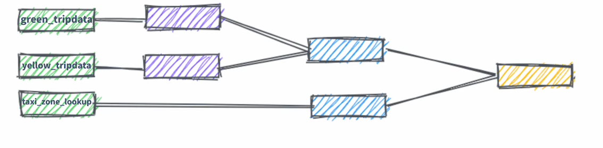

# Analytics engineering

First, as a requirement for this module, we have yellow taxi and green taxi data, as well as fhv datasets. The first two were ingested to big query with the previous modules. And the fhv data was ingested with the kestra flow shown in the following file: [09_gcp_fhv_scheduled.yml](09_gcp_fhv_scheduled.yml).

# Setting up Dbt core with docker and BigQuery

First, we need to use this [Dockerfile](docker_setup/Dockerfile) based on the official dbt git [here](https://github.com/DataTalksClub/data-engineering-zoomcamp/blob/main/04-analytics-engineering/docker_setup/Dockerfile). Note that I've changed the image version to the current dbt big query image according to [this](https://github.com/dbt-labs/dbt-bigquery/pkgs/container/dbt-bigquery)

This Dockerfile contains various "targets" meaning that you can indicate in your docker-compose which part of the file it should run. They are defined in the docker file with something like `FROM base AS target_name`

Afterwards, set up a [docker-compose file](docker_setup/docker-compose.yaml) with context to where the Dockerfile is and the target for big query portion of the dockerfile.

Make sure to mount three volumes as needed for dbt:

- for persisting dbt data
- path to the dbt `profiles.yml`
- path to the `google_credentials.json` file which should be in the `~/.google/credentials/` path

Create `profiles.yml` file in `~/.dbt/` in your local machine or add the following code in your existing `profiles.yml` 

* NOTE: Despite the profiles.yml being in your local device, the `keyfile` path should be the one on the container (if they're not the same) since this runs inside the container. 

  ```yaml
  bq-dbt-workshop:
    outputs:
      dev:
        dataset: <bigquery-dataset>
        fixed_retries: 1
        keyfile: /.google/credentials/google_credentials.json
        location: EU
        method: service-account
        priority: interactive
        project: <gcp-project-id>
        threads: 4
        timeout_seconds: 300
        type: bigquery
    target: dev
  ```


Run the following commands -
  - ```bash 
    docker compose build 
    ```
  - ```bash 
    docker compose run dbt-bq-dtc init
    ``` 
    - **Note:** We are essentially running `dbt init` above because the `ENTRYPOINT` in the [Dockerfile](Dockerfile) is `['dbt']`.
    - Input the required values. Project name will be `taxi_rides_ny`
    - This should create `dbt/taxi_rides_ny/` and you should see `dbt_project.yml` in there.
    - In `dbt_project.yml`, replace `profile: 'taxi_rides_ny'` with `profile: 'bq-dbt-workshop'` as we have a profile with the later name in our `profiles.yml`
  - ```bash
    docker compose run --workdir="//usr/app/dbt/taxi_rides_ny" dbt-bq-dtc debug
     ``` 
    - to test your connection. This should output `All checks passed!` in the end.

    - **Note:** The automatic path conversion in Git Bash will cause the commands to fail with `--workdir` flag. It can be fixed by prefixing the path with `//` as is done above. The solution was found [here](https://github.com/docker/cli/issues/2204#issuecomment-638993192).
    - Also, we change the working directory to the dbt project because the `dbt_project.yml` file should be in the current directory. Else it will throw `1 check failed: Could not load dbt_project.yml`


## Some extra setups I did to use this docker configuration

This is more of a workaround, but in the current set up you have to execute the docker-compose from the folder where the docker files are located and it is a cumbersome command to type up:

```bash
docker-compose run --workdir="//usr/app/dbt/taxi_rides_ny" dbt-bq-dtc debug
``` 

So another option is to create an executable file which does this for us:

```bash
#!/bin/bash
docker-compose -f /home/leo/leo_data_engineering/04-analytics-engineering/docker_setup/docker-compose.yaml run --workdir="//usr/app/dbt/taxi_rides_ny" dbt-bq-dtc "$@"
```

And to make it even easier, I've also set up an alias in `~/.bashrc`

```bash
alias d-dbt='/home/leo/leo_data_engineering/04-analytics-engineering/docker_setup/dbt.sh'
```

This is more similar to running dbt installed in the host computer and saves a lot of hassle when running dbt. Either way, the best way would probably be to run it locally and use things like dbt power user extension like I do in my work set up. That being said, for the purposes of the course and the limited space on the vm I am working on, I will settle with the docker configuration.

### Run it in interactive mode

Another option that I found was to run the container in interactive mode. All I had to do was change the entrypoint in the docker file to `bash` rather than `dbt` 

then rebuild the docker compose with `docker-compose build`

and finally simply run the container in interactive mode with `docker-compose run -it --workdir="//usr/app/dbt/taxi_rides_ny" dbt-bq-dtc`

afterwards the container will remain active and can enter from a different terminal with: `docker exec -it [container id] sh`

# DBT

We'll use dbt to create facts, dimensions and datamarts in a modular way. 

## Anatomy of a dbt model

dbt models have a configuration with various materialization strategies. The model itself is a simple sql query, and dbt will take care of preparing the DDL according to our configurations to create what we've requested.

Materializations can be:
* Ephemeral
* Table
* View
* Incremental

In dbt we will prepare modular data modeling as shown in the following picture 

### Sources in dbt

Sources are data loaded to the dwh which we use for the models. This is defined in the yml files in the models folder and it is used by the source macro on each model to compile the source name to the right schema, as well as set up dependencies properly. In the sources yml file, freshness configuration can be set

### Seeds

Seeds are csv files stored in our repository on the seed folder. It's useful for version conrolling and it's equivalent to a copy command. It is useful for data that doesn't change frequently. It is run with `dbt seed -s file_name`

### References

The ref macro is used for existing dbt models and it will compile the models in any environment you are using. It also handles dependencies automatically. 

### Macros

They can be used for control structures such as if statements and for loops in sql. They use jinja as a templating language and they allow us to generate code inside our models. 

The macros are analogous to functions in most programming languages. 

### Packages

Packages are analogous to libraries in other programming languages. They are basically projects which we can use in our own project. 

Adding a package to your dbt project means that you can use their models and macros in your own project. 

In order to import the packages from packages.yml file, one must run `dbt deps`


### Variables

Variables are useful for defining values that should be accessed across the project. We can define variables in dbt_project.yml or even in the command line. We can use a macro in dbt to get the values from that variable. `{{var('...')}}` 

An example of using jinja for logic and a variable inside a model can be seen below. 

```


  limit 100


```

### Tests

Tests are assumptions that we make about our data. They are essentially `select` statements that return an amount of failing records. Tests are defined in the .yml file and can be either standard tests or custom tests. 

Some of the standard tests provided by dbt are:

* unique
* not null
* accepted values
* a foreign key to another table

On the other hand, you can create custom tests as queries specific to your use case that return failing records. 

### Documentation

Dbt provides a way to generate documentation about your project. You can add documentation in the .yml files, including your tests, model descriptions, column descriptions, etc. 

Dbt presents the documentation by hosting it on a website which can be visited and there you can see the lineage of your models and all the other documentation bits you've included as well as some automatic ones.

To generate the documentation run: `dbt docs generate`

To host the documentation website run: `dbt docs serve`

This will start serving a website which can be viewed in your browser by default in `http://localhost:8080`


### Deployment

Normally we develop in a separate branch than the main branch, it has a separate environment where we can test and make sure everything works well safely, to then pass it to the production environment through the deployment process.

Ideally the development environment is on a different schema and ideally a different user, so it cannot accidentally affect the production environment.

A development - deployment workflow will be something like:

* Develop in a user branch
* Open a PR to merge branch into main branch
* Merge the branch to the main branch
* Run the new models in production environment using the main branch
* Schedule the models