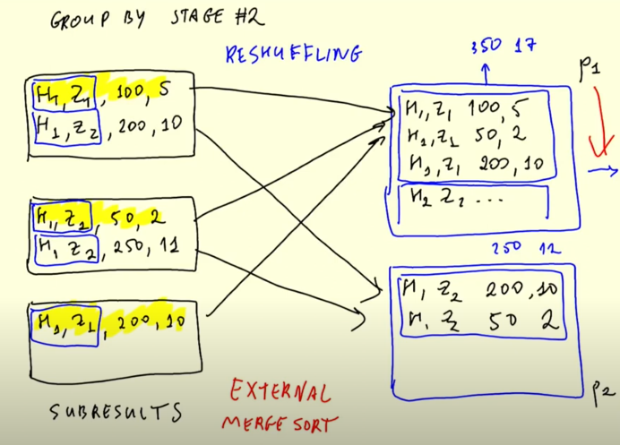

# Batch processing

There are multiple ways to process data, for example in batch and in streaming. This week we'll work with batch processing.

When we talk about batch processing, we take a large set of data, process it in some job and then can introduce it to a dataset. 

Batch processes are usually weekly, daily, hourly and even shorter periods in some cases.

## Technologies

Often we use python scripts for the ingestion and other processes, also sql for processing data as it is very popular. Other tools can be spark and flink for batch jobs, in this case we will focus on spark.

Normally we use some orchestrator, such as airflow to run the python scripts at a given schedule.

## Advantages of batch jobs

They are convenient and relatively easy to manage, they allow for retries as they don't happen in real time. They are generally scalable, so for a larger batch we can scale up the processing power for these jobs.

A possible dissadvantage is velocity, since for example an hourly job, we need to wait for the hour to finish, in addition to waiting for the jobs that are scheduled to complete. So you might have to wait 1.5 hours before you can see the data, depending on how long it takes to process. This might lead some jobs to be more suitable for streaming, where you need the inmediacy, but most of the times this is not the case and it's okay to wait.

Majority of data products and jobs tend to be in batch, while streaming is more for specific use cases.


## Apache Spark

Spark is a data processing engine that provides an interface for large-scale data processing.

Normally the process is in some data lake for example, and processed in spark and then it is saved processed into a datawarehouse most likely.

Spark is written in scala originally, but there are wrappers for other programming languages, including python `pyspark` which is a very popular option. 

Spark is used for both batch and streaming, even though in this module we will only cover batch processing with spark.

## When to use Spark?

Normally it is used when the data is in a datalake (S3/GCS), then process it in spark and then save it to a datalake or even a datawarehouse.

There are some tools to query directly s3 or datalakes with sql, such as hive, presto/athena which can be useful sometimes. If you need more flexibility than sql can provide, then you might want to use spark.

You can always mix and match, as in this typical batch job


# Installation and set up

We'll follow [these instructions:](https://github.com/DataTalksClub/data-engineering-zoomcamp/blob/main/05-batch/setup/linux.md) 


# Spark/PySpark

In spark we are working with a cluster, so we have multiple nodes in that cluster that can do the work. So in these cases, having one large file is not ideal, as it is less parallelizable. Ideally we want to be able to distribute the load properly. 
Below is an example of multiple files going to various executors inside the cluster.

However, if we were to have a single large file instead of many files, we would only take it on a single executer and have the other ones being idle. We can fix this by splitting a large file in multiple smaller ones. 

Here is the better scenario:


Here is the scenario to avoid, one large file, not able to paralelize:


In the code shown in [](code/04_pyspark.ipynb), we can see how to interact with and use pyspark, it also shows how to go from a massive csv file, to a more manageable set of files in parquet.

# Spark dataframes

We've already created a dataframe from the csv, but also we can create a new one out of the parquet files previously created:

`df = spark.read.parquet('fhvhv/2021/01')`

In spark there are commands that are executed right away and commands which are not. These are Actions vs Transformations:

**Transformations**

* Selecting columns
* Filtering
* Joins
* Group by 

These are comands which are not executed right away, spark gets them and sets up a flow of tasks that will take into effect when an action is created. So they are "lazy", they can be set up but they're not run right away.

**Actions**

Actions are eager, meaning they get executed immediately. 

* Show, take, head
* Write

# Prepare data for this module

Following along, I've created the file [](code/download_data.sh) to download yellow and green taxi data for 2020 and 2021.

After that, look at [](code/06_taxi_schema.ipynb) to see about converting the files into parquet.

# SQL with Spark

You can also perform sql operations in spark. There is an example of this in the file [code/07_spark_sql.ipynb](code/07_spark_sql.ipynb). Here the green and yellow datasets are united and a query from week 4 is replicated in spark.

This can be very useful since sql is well known and simple, but also because you can perform these operations directly from the datalake without having to go through the datawarehouse.

# Spark internals

## Spark Cluster

Normally we write spark code, for example in pySpark and we execute that code against a cluster. What usually happens is that we use a spark-submit to send the instructions to the master, which in its role of coordinator of the tasks inside the cluster, will ensure that it gets done. 

Inside the cluster there are executors, which the master coordinates to perform the operations. An example can be seen here:


Let's say we have a dataframe, which consists of partitions, say each partition is a parquet file worth of data. When the master orchestrates a job, it might ask various executors to pull a given partition of the data frame and then they all do a task in parallel, they save the results somewhere, and once they are done, if there are more partitions to be processed, they pick up the next one and so on until they finish. 

Nowadays these dataframes are usually saved in S3/GCS, but before it was very common to use HDFS, where each executor had a portion of the data and it was distributed among them, with some redundancy as well to ensure the data is properly maintained. This made a lot of sense, since it made it so the data didn't have to be pulled into the executors, instead they would already have the data for the most part which sped things up. These days, this is less of a concern, given that usually we're working on S3/GCS while working on a cluster inside the same datacenter, where pulling the data to an executer is not that slow or expensive. It is a bit slower than having the data already there, but it's not a massive penalty. 


## GorupBy in Spark

Although in the [code/07_spark_sql.ipynb](code/07_spark_sql.ipynb) notebook we've already seen a group by done in sql, here we'll cover how it works internally in spark. This can be seen in [](code/08_groupby_join.ipynb).

When spark is performing a groupby, it follows this type of process:


It has multiple executors working, for example in the picture above we're working with 3 partitions, so let's say it works with three executors to process this data. It works on each partition individually, for example on the first partition, the executor performs a filter and a group according to the instructions it received and generated some subresults/intermediate results, which basically give an answer for the grouping of the subset of data that the first partition contained. So it only has part of the answer. 

In the meantime, the same thing is happening with the other partitions, and once they are done, another step called reshuffling happens. This step consists of putting together records from different partitions that have the same group by key, that way you end with another set of records inside each partition that can be grouped up further. This is called an "external merge sort"

these can be put together to a final result grouping further the values between the various partitions. This would happen in a second stage, as it can be seen below: 



In this case, it wasn't necessary, but you can also repartition the dataframe before writing to the file to make sure it is properly optimized. Generally, we would like to avoid shuffling read/write as much as possible, as this is an expensive operation. This means that it's moving data around between partitions. Since we're not talking about massive files, it's not necessary to split them in too many partitions, since that would cause a lot of reshuffling to happen. In this situation, spark was smart enough to be efficient, but sometimes we might want to force it in the following way:

```
df_yellow_revenue\
    .repartition(20)\
    .write.parquet('data/report/revenue/yellow', mode='overwrite')
```

## Joins in Spark

Joins in spark use some of the same tools talked about in the groupby section, so we'll continue in the same notebook [](code/08_groupby_join.ipynb).

When performing the join operation, we can see the following DAG


The way that it works is the following, we have records in both yellow and green dataframes. We are doing the join in hour and zone, so those are they keys used on each partition. After these are mapped, reshuffling happens so that records that are alike are placed in the same partitions:


Now, similarly to the group by reduce, we are placing together records with the same keys, since we are doing an outer join, if one of the tables doesn't have values for that key, it'll simply show null. But if we're doing an inner join, they would just not show up. So the reducing will be different according to the join. This particular step is called sortMergeJoin in the DAG from spark. 

Another thing to point out, as can be seen on the notebook where the join was done with the zones table, is that there was a step called BroadcastExchange which was not in previous joins or groupby. This is because we are joining to a small table. What happens in these cases is that instead of doing the merge sort join, each executor gets a copy of the zones dataset, since it is so small. The join happens on each executor without the need to shuffle any data. 