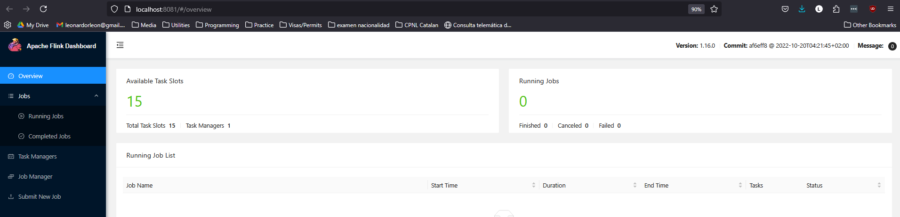

# Streaming with Kafka

## What is kafka streaming?

The example for this class consists of a notice board. In the notice board there are topics, producers and consumers.

Since it's an essential element of kadka, what is a topic?

### Topic

Let's say we have an application which records the temperature every few seconds. So every 30 seconds it will record the temperature and send it out. Each of these events are a single data point. In kafka, we usuaally talk about logs, this is how data is shared inside of a topic. 

### Event

Each event contains a message, which can have certain information. In the example above, the message would be the timestamp and the temperature. A message usually has a timestamp, a key and a value.

## Why is kafka special?

It provides a lot of **robustness** and reliability to the topic, so even if the server is going down, you will still receive the data. This is due to replication, as it replicates the data over various nodes. Topics can be small, big, you can have many consumers. It provides a lot of **flexibility** on what we want to do. 

Kafka also provides **scalability**, it can handle increases of data size from 10 events per second to 1000 events per second and continue to work without issues.

## Stream processing and need for it

We used to work in monolithic architectures, which talked to a central database. They used to be genearlly big code repos which talked to multiple databases, but there were many issues with this type of application. Nowadays, the trend is to work in microservices which are smaller set of services which work together to complete the same functions than a monolithic architecture might have performed in the past.

The microservices can talk between them and they could be talking to central databases. This is generally okay when data is not too great, however when there are more microservices and increasing data, you need a streaming system to communicate between them. What usually happens is that we have a kafka topic, generally in terms of events. So whenever a microserivice wants to read from this kafka topic, they can do that. So each microservice might be reading from specific topics. 

Another thing that kafka can do for us is CDC (Change Data Capture), so for example a DB can write to the kafka topic and from there the different microservices can get that data. 


# Confluent

For the purpose of this course, we will use a kafka cluster in cloudgen. The set up can be performed as shown here: https://www.youtube.com/watch?v=ZnEZFEYKppw&list=PL3MmuxUbc_hJed7dXYoJw8DoCuVHhGEQb&index=64

At this time, to be able to use the free credits without inputting your credit card information, you can use the promo code: "CONFLUENTDEV1"

Although in the examples for the 2025 cohort we use red panda to simulate this kafka cluster in local, we can use confluent for a "real case scenario" or project

# PyFlink

PyFlink is the Python API for Apache Flink, a powerful stream and batch processing framework. PyFlink allows you to write Flink applications in Python, enabling you to leverage Flink's capabilities for processing large-scale data streams and batch data. It provides a way to define data processing pipelines, perform transformations, and execute complex data processing tasks using Python, making it easier for Python developers to work with Flink.

We will use pyflink in this case as a way to handle our streaming jobs

## What does Flink do?

Apache Flink is a powerful framework and distributed processing engine for stateful computations over unbounded and bounded data streams. It is designed to run in all common cluster environments, perform computations at in-memory speed and at any scale. Flink's key features include:

- **Stream Processing**: Flink is built for processing data streams, allowing for real-time data processing and analytics.
- **Batch Processing**: Flink also supports batch processing, making it versatile for different types of data processing needs.
- **Stateful Computations**: Flink maintains state information across events, which is crucial for complex event processing and windowed operations.
- **Fault Tolerance**: Flink provides strong fault tolerance guarantees, ensuring that the state is consistently maintained even in the case of failures.
- **Scalability**: Flink can scale to handle large volumes of data and high throughput requirements.

## Additional components

As can be seen in the [docker-compose.yml](pyflink/docker-compose.yml), we have 4 main elements running at the same time to make the streaming set up work. 

- **redpanda**:

Redpanda is a streaming data platform that is API-compatible with Apache Kafka. It is designed to provide a simple and fast alternative to Kafka. One of the main reasons to use redpanda, is that it allows us to develop in local in a very similar way to a kafka cluster, so we can simply change to a kafka cluster later on if we'd like.

- **jobmanager**:

The jobmanager is set up in the docker-compose file by using the [Dockerfile.flink](pyflink/Dockerfile.flink). It basically sets up from the flink:1.16.0 image and then it runs some configurations to install python to a specific supported version (3.7).

It also takes the requirements.txt file and uses it to install the requirements on the flink image. Finally, it downloads connector libraries needed.

Other configurations include the volumes to bridge to the host and some environment variables, to which the default value is passed along in the format `${VARIABLE:-default}`

The job manager is responsible for managing and coordinating the execution of flink jobs. It handles job scheduling, resource allocation, and task distribution among taskManagers.

- **task manager**:

The third container is using the pyflink:1.16.0 image just configured above, but this time it runs the command `taskmanager --taskmanager.registration.timeout 5 min`. This is also why there is a parameter `depends_on` for the jobmanager, to ensure that docker-compose completes that server before the task manager one. 

The task manager is in charge of executing the tasks on a flink job and managing the resorces required for those tasks. 

- **postgres**:

The final component is the postgres database, which is the simplest container, it basically is the end goal database. We will perform jobs which will pass through redpanda streaming using flink and the jobs will eventually write to the postgres database as a final step. 

## Make

Make is an additional tool that we're going to use to make life easier. It is an automation tool to manage and automate the building and managing of dependencies in software projects. A file called [Makefile](pyflink/Makefile) is used to define the rules and commands for building the project. 

It works by setting up targets which are labels that define a specific task to be executed. For example, in the current makefile in this project, there is a target `up` which is used to encapsulate the docker compose up command, so instead of typing the whole command and parameters, we can use `make up` as a shortcut.


# Working with the whole set up:

In my case, I had to modify the makefile to use `docker-compose` since the docker compose plugin is not directly available in ubuntu it seems. Anyways, the docker-compose works just as well.

To start all the containers, you can simply run: `make up` which will use the make file to run the docker-compose action configured. On my first run, since I wanted to view the output, I used directly: `docker-compose up --build --remove-orphans`. In the makefile it is run in detached mode, which is good generally, but this time I wanted to see all the outputs coming from the containers.

We can do a quick check on connecting to the postgres database set up with pgcli as we've done on the first module:

        pgcli -h localhost -p 5432 -u postgres -d postgres

Otherwise, we can also set up pgadmin as we've done in previous modules in the same docker-compose configuration.

When we run the docker compose up, we will wait until all components are set up, then we can try to access the flink ui:



Here there should be a 1 next to `task managers`, meaning the task manager has successfully attached. 

We can also go into pgadmin if it is set up, in `localhost:8080`

## Set up in postgres

Before running our jobs, let's connect to postgres through pgadmin and let's create a `landing zone` for flink to insert the data after its processed it.

so execute in postgres:

```sql
CREATE TABLE processed_events (
    test_data INTEGER,
    event_timestamp TIMESTAMP
)
```

Now that this is set up, we can run the producer [producer.py](pyflink/src/producers/producer.py) to push data to kafka queue, where it will wait to be consumed from.

Note that none of this will show up in the flink ui, because it is mainly to keep track of jobs and such and there are no jobs running at this point, we only produced data to the topic.

If you'd like to see the topics that are available before running one of the jobs we have prepared, you can do something like what is shown in [kafka_admin.py](pyflink/src/other/kafka_admin.py). Although the kafka admin client for python is not able to read contents on the topic, it only works for creating, deleting, listing and generally managing the topics. If you need to get info about what is in the topic, you should use a consumer.

## Runing jobs

### start_job

The first job we're going to run, is the [start_job.py](pyflink/src/job/start_job.py). It is a simple job that takes the data and dumps it into postgres directly. 

The main aspects to take into account on this job are the source table and the sink table.

Basically in this job we create a processed events sink for flink to insert data in postgres. It should match in schema to the table that we have in postgres. The DDL in there is from flink itself, and we have to indicate the connection properties for postgres so that it can write to the DB.

On the other hand, there is also a source table, which is set up similarly, although the configuration here is for the kafka topic itself, so we add the redpanda bootstrap server and the topic name, as well as the offset setting. There are many tradeoffs to the offsets, and those are covered in the lecture. But in summary:

* earliest: means that on the start of the job, it will go and get all the data from the topic. So it will work for backfill situations. Note that this is for job start, after this there will be checkpoints for it to continue from.

That being said, if you kill the job, and run the job again, it will actually create a new job which will work from the beginning using earliest. This is because it is a separate job, the checkpoints are for a specific job from a specific entrypoint. This is something to be careful with.

* latest: latest offset means that it will consume the most recent data from when the job starts. This means that the trade off is the opposite. For example, if you kill the job, and start it later on, it will get data from that latest offset and you will have "missed" the in-between data.

* Timestamp: you can also run the job from a given timestamp.

### aggregation_job

Like in the previous job, let's create a table in postgres called `processed_events_aggregated`.

The main difference in this job is that we'll be aggregating the data. In this case is done through the sql shown in the main `log_aggregation` code. It uses a watermark to provide some extra reliability, basically it allows for some late arriving records to be able to be pulled in to the correct group by set of data. The watermark is set in the source table set up as `event_watermark`, and then it is used in the insert into code by a `TUMBLE` over this watermark. 

I had to make some changes from the code in the original repo, since the original repo code didn't seem to aggregate properly as it included the test_data field in the group by which and it is the field with the highest granularity.


### Notes from homework exercises

Some things that I found while doing the homework exercises is that sometimes you might want to manage the topics or check on their contents so you can properly prepare the source or sink in your jobs. For this, I created some simple utility scripts which allow to list or describe topics: [kafka_admin.py](pyflink/src/homework/kafka_admin.py) and another one to consume a few messages from a topic to check it's contents: [kafka_consumer.py](pyflink/src/homework/kafka_consumer.py).